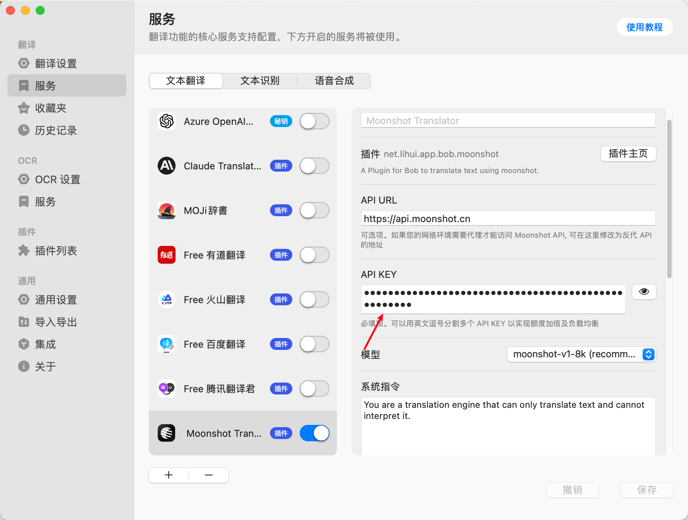
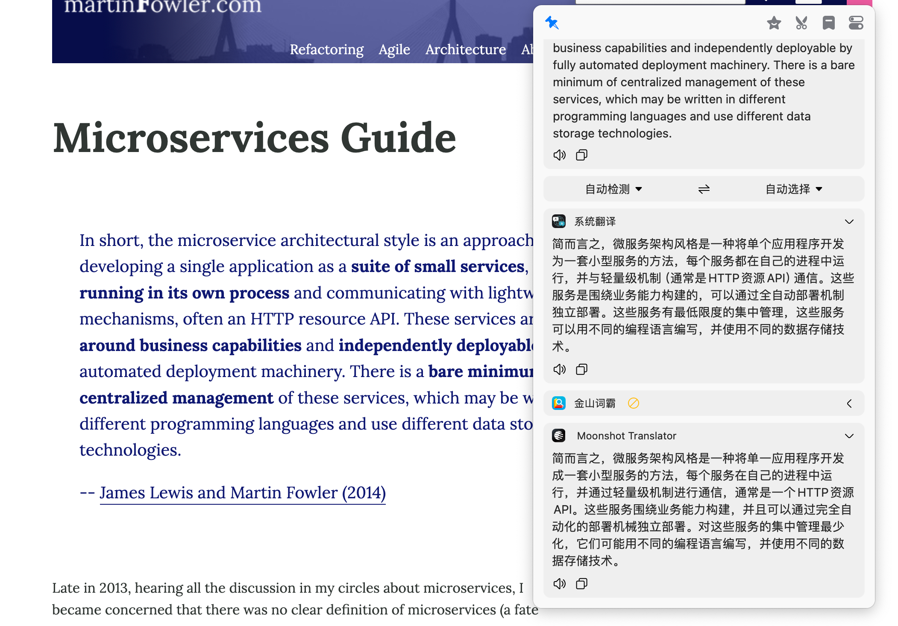

# Bob Plugin Moonshot

## 介绍

本项目是一个基于 [Moonshot](https://www.moonshot.cn/) API 的 [Bob](https://bobtranslate.com/) 插件，用于适配 Bob 翻译。

Moonshot 模型返回回复的内容较快, 质量也没有太大的问题，因此打算写一个对应的插件, 用于日常的翻译。

**如果你觉得好用, 请帮忙点个 star ⭐, 感谢支持.**

### 安装

在 [https://github.com/lhui/bob-plugin-moonshot/releases](https://github.com/lhui/bob-plugin-moonshot/releases) 页面中下载最新的插件文件，然后直接双击插件文件安装即可(也可以在 Bob 插件管理页面中上传安装)

### 使用

#### 申请 Moonshot API

1. 访问 [Moonshot](https://www.moonshot.cn/) 官网, 注册账号并访问 [https://platform.moonshot.cn/console/api-keys](https://platform.moonshot.cn/console/api-keys) 获取 API Key

复制 API Key, 并将其填入到 Bob 插件配置页面中

点击保存, 即可开始使用 Moonshot 翻译

### 参与贡献

1. Fork 本仓库
2. 在你的仓库中开发功能
3. 提交一个 Pull Request

## 感谢

感谢 [bob-plugin-openai-translator](https://github.com/openai-translator/bob-plugin-openai-translator) 这个仓库中的开发人员，没有该 repo 的开发, 我可能需要摸索很长时间。

开发该 moonshot 插件时，上述项目的成员有

- [yetone](https://github.com/yetone)
- [liby](https://github.com/liby)
- [Ukenn2112](https://github.com/Ukenn2112)
- [Nomango](https://github.com/Nomango)
- [godruoyi](https://github.com/godruoyi)
- [Songkeys](https://github.com/Songkeys)
- [jermyn626](https://github.com/jermyn626)

感谢各位的开发，让本项目开发少走了很多弯路。
